# 跑马灯实验流程指导

## 1. 创建 Vivado 工程
- 首先将本系列[实验代码](https://github.com/bit-mips/bitmips_experiments)克隆至本地，然后本实验会在该系列实验目录下创建一个工程
    ```
    git clone git@github.com:bit-mips/bitmips_experiments.git
    ```

- 打开 Vivado，点击 `Create Project` 来创建一个新的工程

    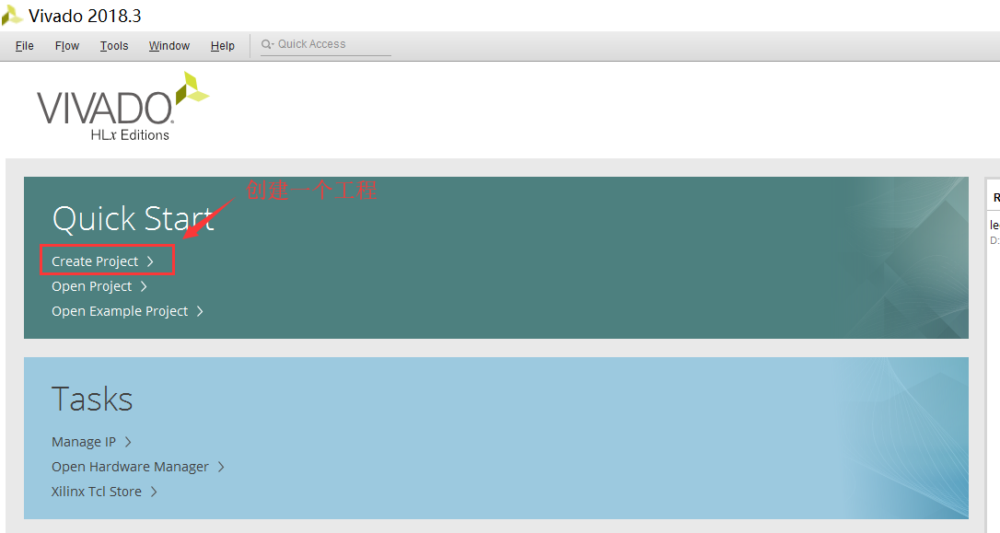

- 点击 `Next`
    
    

- 然后填写项目名称，工程路径选中刚才克隆至本地的本系列实验代码目录，即 `.../bitmips_experiments/lab1`，`Create project subdirectory` 选项选中，目的是在该工程路径下再创建一个子目录以更好的管理项目。然后点击 `Next`。**注意：路径中不要有中文！！！**

    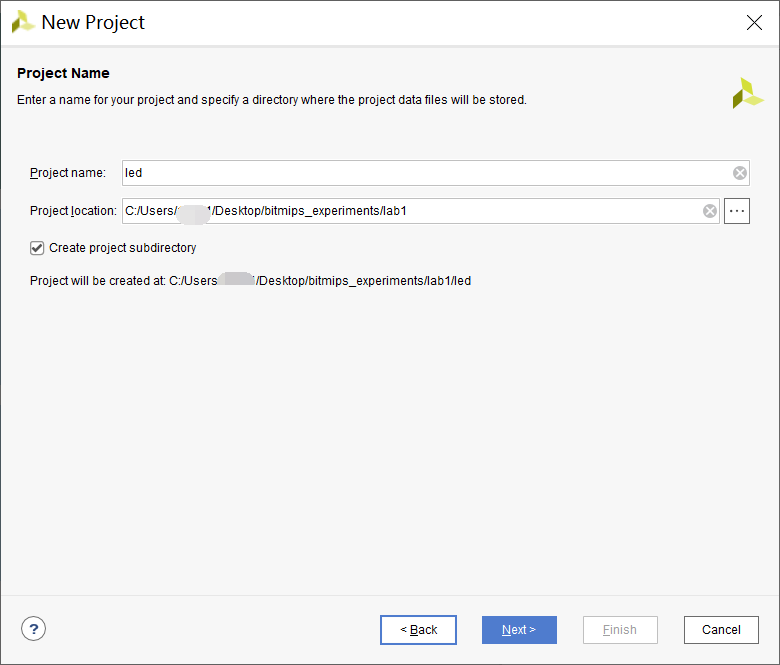

- 然后选中 `RTL Project`，同时选中 `Do not specify sources at this time`，这个选中之后可以在后期再添加源文件，此时项目创建过程中不用添加。不勾选也许

    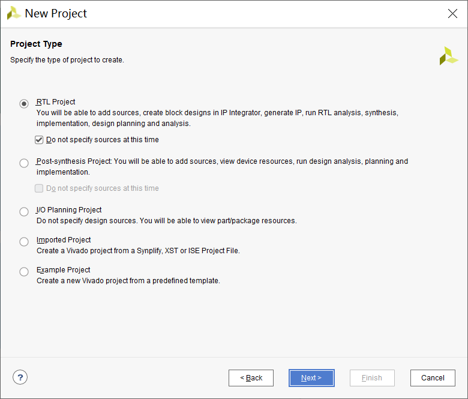

- 然后选择开发板，精工开发板的型号是下面这个，直接粘贴到 `Search` 处搜索。选择目标开发板，点击 `Next`

    ```
    xc7a35tcsg324-1
    ```

    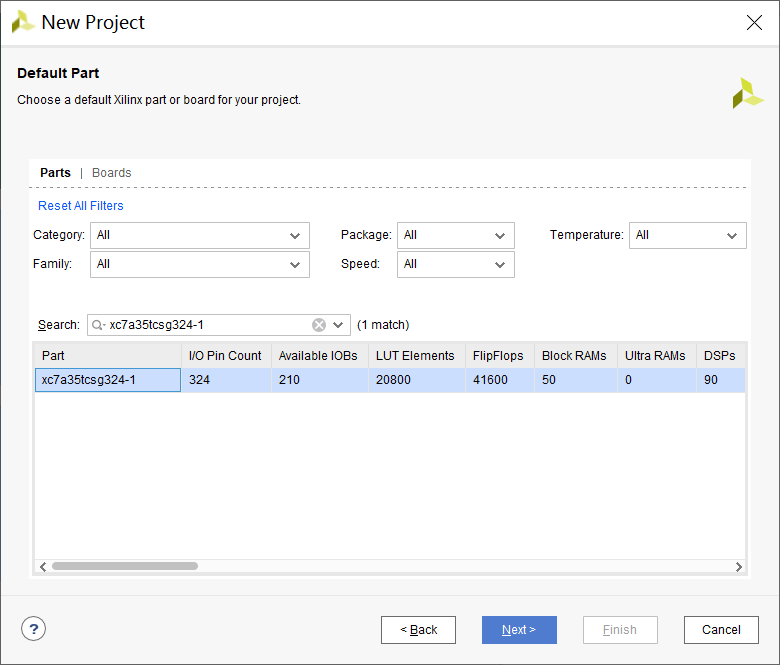

- 查看 Summary，没有问题就点击 `Finish` 完成创建
    
    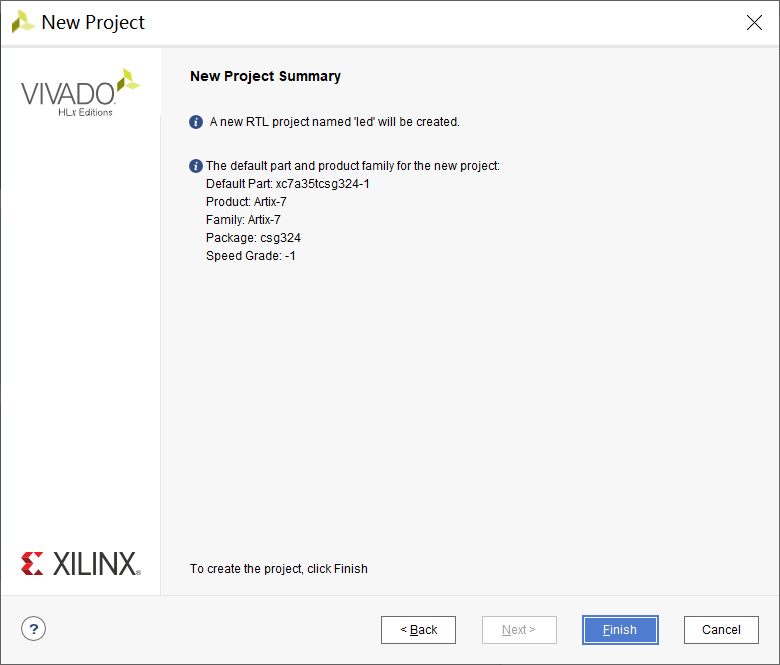

## 2. 创建源文件
- 完成工程创建之后，Vivado 会打开此工程。点击 `+` 可以创建文件
    - 在 `source` 处可以看到本工程的文件结构：
        - Design Sources：代码源文件
        - Constraints：约束文件
        - Simulation Sources：仿真文件

    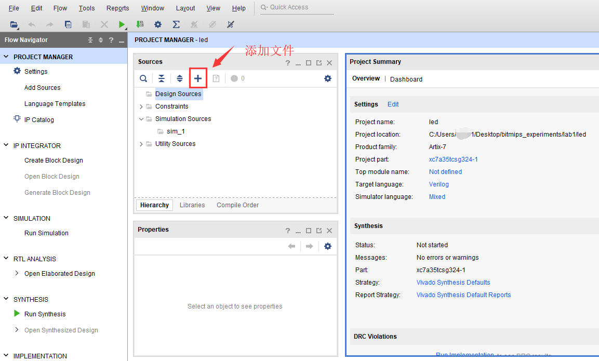

- 选择 `Add or Create design sources` 来创建一个工程设计源文件。点击 `Next`

    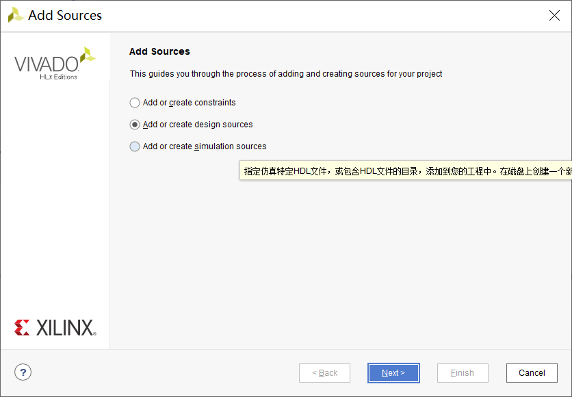

- 选择创建一个文件

    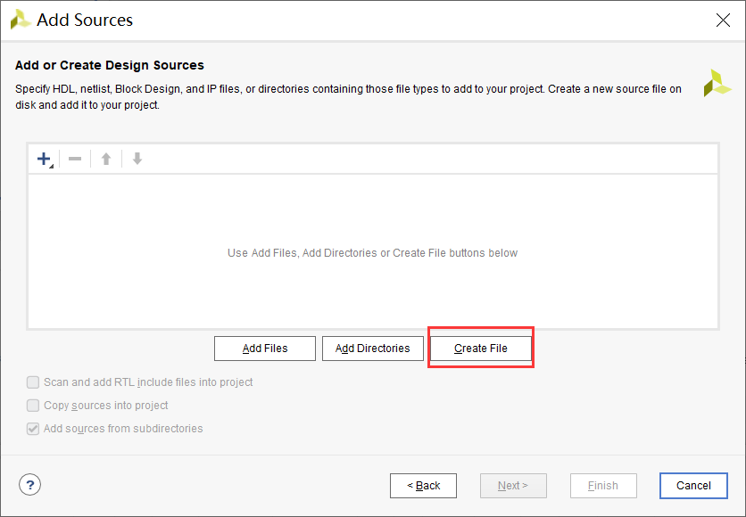

- 给文件命名，路径默认即可，文件类型为 `Verilog`，之后一路 `Next`、`OK`、`Finish` 即可

    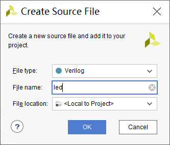

- 然后双击刚才创建的文件，编辑文件。将以下代码复制粘贴至该文件。**需要补全该代码**，实现跑马灯功能。

    ```
    `timescale 1ns / 1ps

    module led#(
        parameter DELAY_CYCLE = 50000000
    )(
        input   wire        clk,
        input   wire        rst,
    
        output  wire[7:0]   led_o
    );
    /******** your code ********/
    
    
    endmodule
    ```

    


- `led.v` 接口说明：
    |信号|类型|位宽|说明|
    |-|-|-|-|
    |clk|input|1|时钟信号|
    |rst|input|1|复位信号|
    |led_o|output|8|led 控制信号，高电平 led 亮，低电平 led 暗|

- 该 `led` 模块被设计为可配置模块（见本文最后对可配置模块的介绍），参数 `DELAY_CYCLE` 是一个可配置参数，本模块要求每过 `DELAY_CYCLE` 个时钟周期输出信号 `led_o` 的值发生改变，改变顺序如下：`0x01 -> 0x02 -> 0x04 -> 0x08 -> 0x10 -> 0x20 -> 0x40 -> 0x80 -> 0x01 ...`，由此循环往复，这样可以控制 led 灯从第 1 个到第 8 个逐个亮灭。设置 `DELAY_CYCLE` 可配置参数的好处就是，在仿真的时候我们可以使用一个较小的数，在下板时使用默认的较大的数，这样在仿真和下板是都能较好的观测到相应的变化。

## 3. 创建仿真源文件
- 同创建设计源文件一样点击那个 "+"，然后选择 `Add or create simulation sources`

    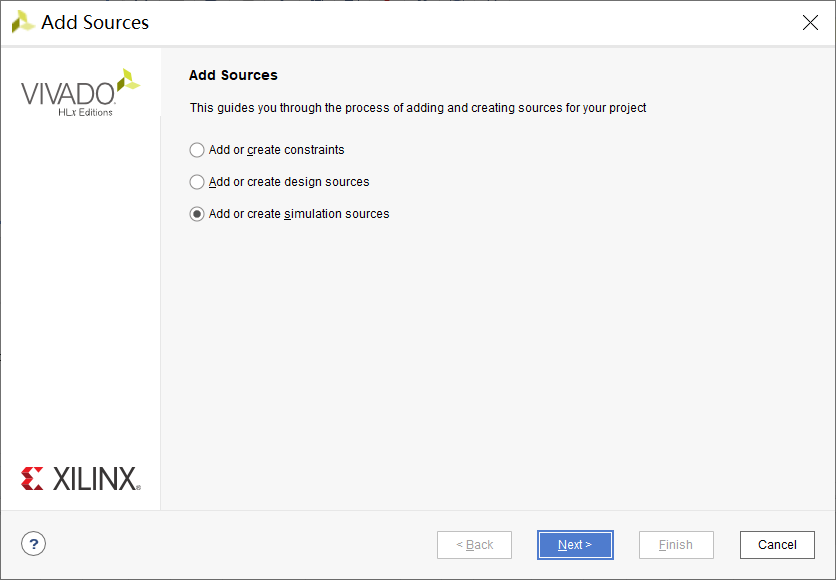

- 然后 `Create file`，默认路径，命名为 `testbench`，之后一路 `Next`、`OK`、`Finish` 即可

    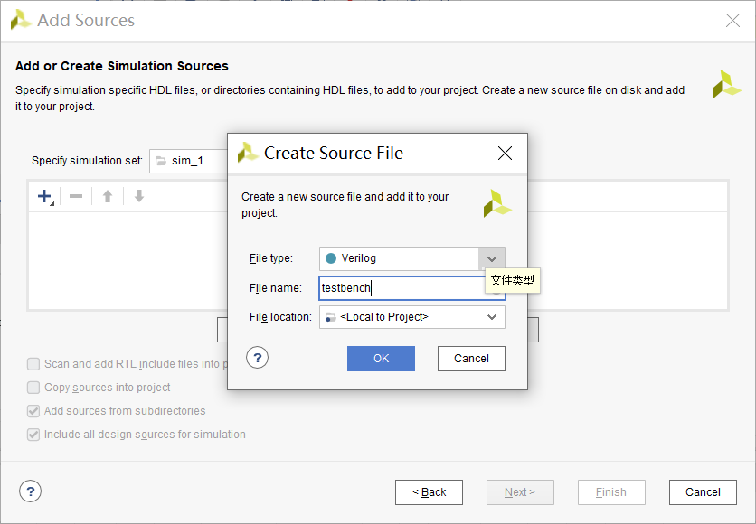

- 右键单击 `testbench.v` 文件，点击 `Set as top` 将其设置为 top 文件

    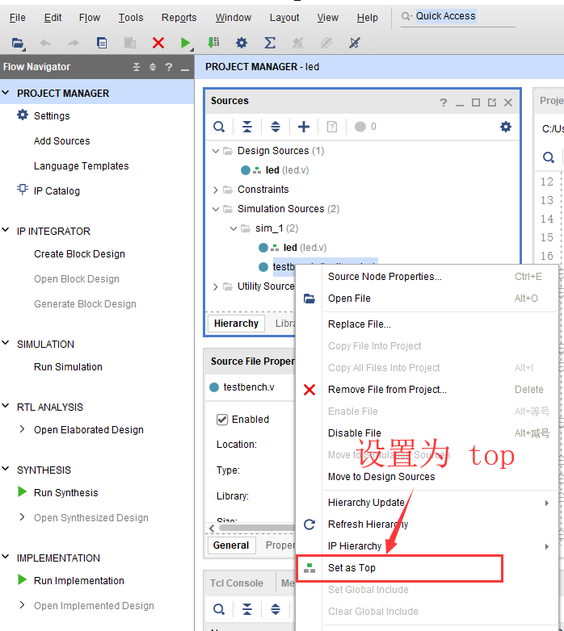

- 将以下代码复制粘贴进 `testbench.v` 文件

    ```
    module testbench();

        reg         clk, rst;
        wire[7:0]   led;
    
        always #5 clk = ~clk;
    
        initial begin
            rst = 1'b0;
            clk = 1'b0;
            #100
            rst = 1'b1;
        end
    
        led #(
            .DELAY_CYCLE(100)
        ) led0(
            .clk(clk),
            .rst(rst),
        
            .led_o(led)
        );
    
    endmodule
    ```

## 4. 执行仿真测试
待设计文件和仿真文件都准备好之后就可以进行仿真了，点击 `Run Simulation` 稍等即可。

下图即显示的是仿真波形图，可以看到信号 `led` 正按照预期结果来改变。下图是 16 进制结果显示的。**（注意缩放波形图来观测）**

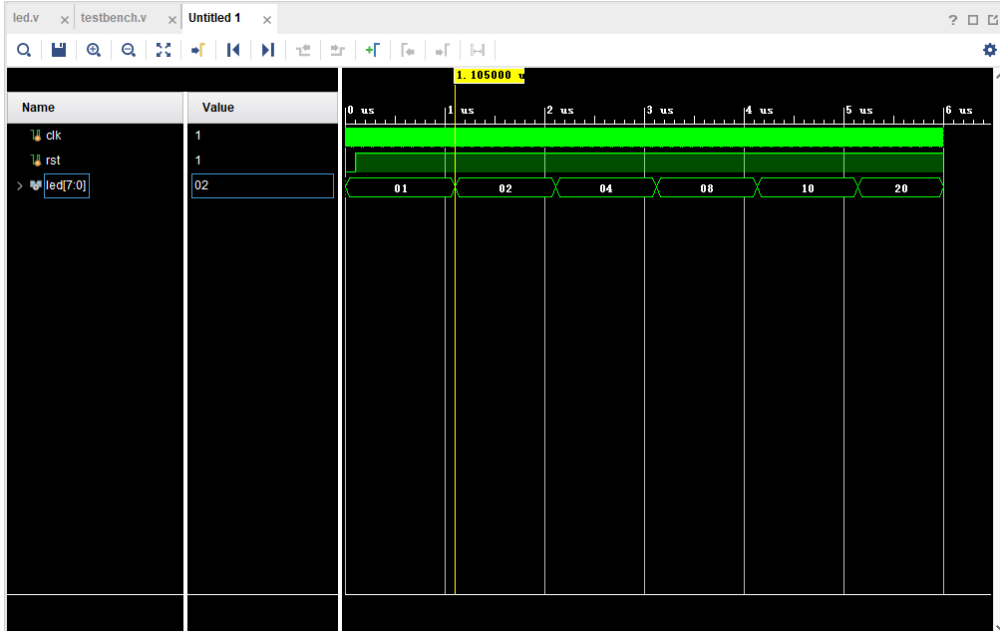

## 5. 创建约束文件
约束文件可以直接通过文本编辑的方式来进行编写，但是这种方式不太适合初学者，下面介绍使用可视化界面操作来创建。

- 首先将工程综合，点击下图中的综合 `Run Synthesis`

    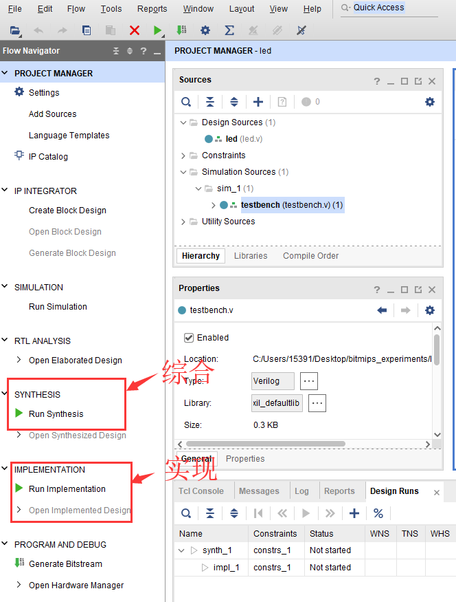

- 综合完会弹出一个界面，选择 `Open Synthesized Design`，也可在左侧边栏 `SYNTHESIS -> Open Synthesized Design` 处打开

    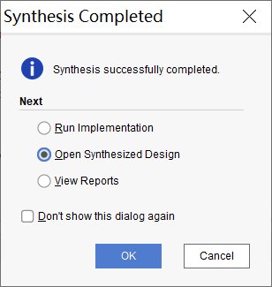

- 点击工具栏 `Windows -> I/O Ports`，之后在 `I/O Ports` 中即可配置管脚

    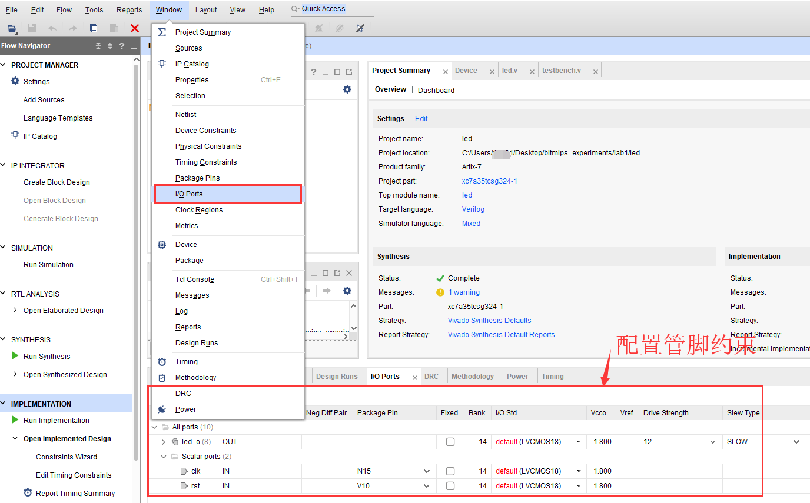

- 相关配置如图，关于引脚 `Pin` 对应的值可以查看开发板手册。然后 `ctrl + S` 保存文件

    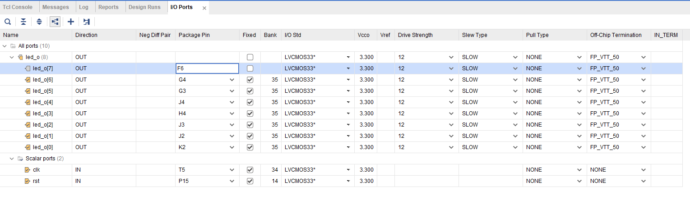

    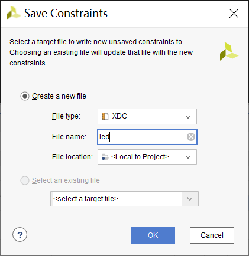

- 此时退出 `Open Synthesized Design`，在 `Sources -> Constraints` 处可以看到刚才保存的约束文件

## 6. 生成 bit 流并下板测试
- 有了约束文件之后就可以开始实现，点击 `IMPLEMENTATION -> Run Implementation` 进行实现。在弹出框点击 `Generate Bitstream`， 或者直接点击左侧边栏的 `PROGRAM AND DEBUG -> Generate Bitstream`。

    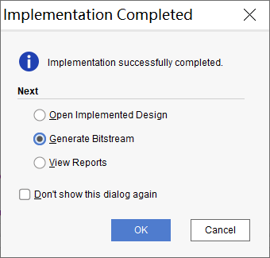

- 生成比特流之后，打开 `Open Hardware Manager`，

    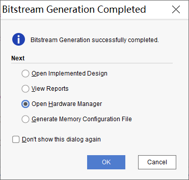

- 将开发板链接电脑，然后点击下图自动链接按钮

    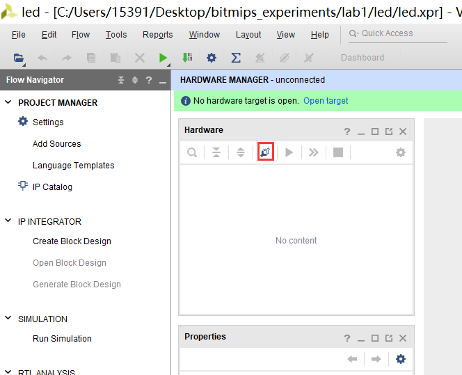

- 选中板子然后 `Program device`

    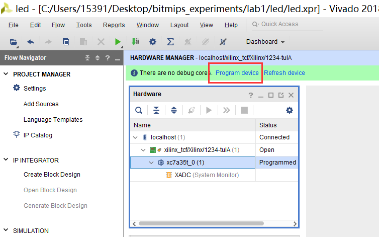

- 然后选中刚才生成的比特流文件，一般默认就是，然后 `Program`

    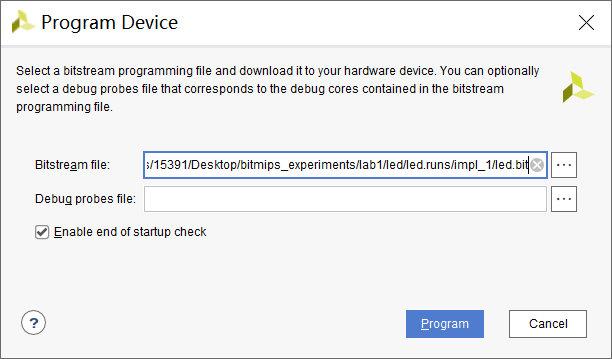

- 下板之后就可以观测板子运行结果是否与预想的一致


## 可配置模块说明
将模块设计为可配置模块时，可以方便的对模块进行配置，而无需改动模块代码。因此，我们极力推荐将模块设计为可配置的，这样能够根据不同需求将模块进行配置适用于不同的场景。

一个可配置模块写法如下：
```
module module_name#(
    parameter p1 = value1,
    parameter p2 = value2,
    ...
)(
    // 正常输入输出信号
    input   wire    A,
    input   wire    B,
    output  wire    C,
    ...
    );

    // 具体代码部分使用参数 p1，p2
endmodule
```

以上模块在调用时，如果没有指定 p1，p2 这些参数的值，那么就会使用默认的 value1，value2

下面代码使用上述模块：
```
module_name #(
    .p1(new_value1),
    .p2(new_value2),
    ...
) module_instance(
    .A(),
    .B(),
    .C(),
    ...
);
```

上述代码即对该模块里的参数进行了重定义，更新为 new_value1，new_value2。这样不同调用者可能有不同的参数，可以很方便的使用。

