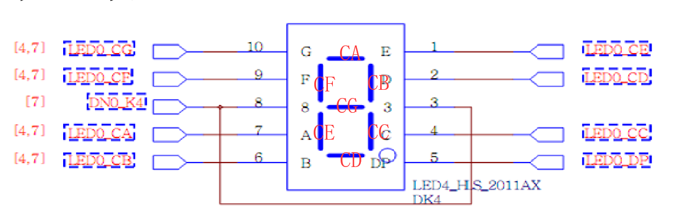
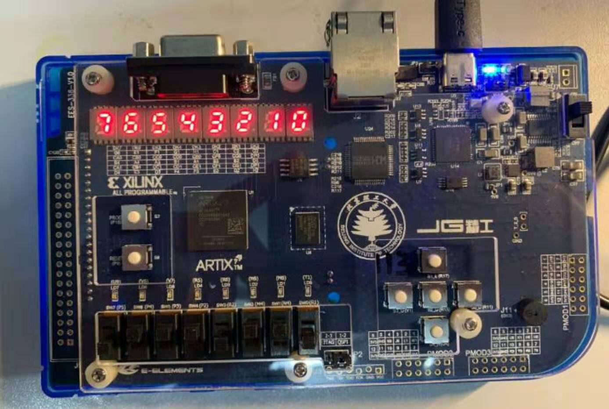

# 数码管显示实验流程指导

使用 Vivado 打开 `lab1` 下的 `num_led` 工程。

## 数码管介绍

本实验最后也是会将工程生成 bit 流来下板运行的，使用的开发板是精工开发板。在精工开发板上集成有 8 个 7 段数码管，本实验即要使用这 8 个数码管。

7 段数码管为共阴极数码管，即公共极输入低电平，那么就需要提供正向信号（即高电平）来使得数码管被点亮，同时每个数码管还有一个 `段选信号`（类似于片选信号），这就是一个使能信号，要想数码管被点亮，该端也需要接高电平。

管脚约束如下：

|名称|原理图标号|FPGA IO PIN|
|-|-|-|
|A0 |LED0_CA|B4|
|B0 |LED0_CB|A4|
|C0 |LED0_CC|A3|
|D0 |LED0_CD|B1|
|E0 |LED0_CE|A1|
|F0 |LED0_CF|B3|
|G0 |LED0_CG|B2|
|DP0|LED0_DP|D5|
|A1 |LED1_CA|D4|
|B1 |LED1_CB|E3|
|C1 |LED1_CC|D3|
|D1 |LED1_CD|F4|
|E1 |LED1_CE|F3|
|F1 |LED1_CF|E2|
|G1 |LED1_CG|D2|
|DP1|LED1_DP|H2|
|DN0_K1|LED_BIT1|G2|
|DN0_K2|LED_BIT2|C2|
|DN0_K3|LED_BIT3|C1|
|DN0_K4|LED_BIT4|H1|
|DN1_K1|LED_BIT5|G1|
|DN1_K2|LED_BIT6|F1|
|DN1_K3|LED_BIT7|E1|
|DN1_K4|LED_BIT8|G6|


- DN0_K1，DN0_K2，DN0_K3，DN0_K4
    - 这几个信号是右边四个数码管的段选信号
- A0，B0，C0，D0，E0，F0，G0，DP0
    - 这几个信号是一组用来控制右边的四个数码管的亮暗
- DN1_K1，DN1_K2，DN1_K3，DN1_K4
    - 这几个信号是左边四个数码管的段选信号
- A1，B1，C1，D1，E1，F1，G1，DP1
    - 这几个信号是一组用来控制左边的四个数码管的亮暗

举例：
- 假如要控制最右边和最左边两个数码管亮，那么就可以让 DN0_K1 和 DN1_K1 置高电平，其他段选信号置低电平，此时这两个数码管就被“选中”，其具体的显示内容就需要根据 A0 ~ G0 和 A1 ~ G1 来确定。
- 假如 DN0_K1 和 DN0_K2 被置高电平，那么最右边两个数码管就被选中，且他们显示的内容是一样的，都是由 A0 ~ G1 来确定。

A ~ G 信号具体控制数码管中的各段如下图：



举例：
- 让 A，B，G，E，D 置高电平即是显示出数字 “2”

具体的十六进制中 16 个字符的显示如下：

 

但是有个问题必需考虑，因为在同一**时刻**，数码管最多只能提供两组控制信号（即 CA0 ~ CF0 和 CA1 ~ CF1），也就是说只能在同一**时刻**显示出两个数码管，那么肉眼该如何看到 8 个数码管同时显示的数值呢？我们知道，人眼是有`视觉暂留`效应的，即我们看到的景象不会立刻消失，基于这一点，我们可以在短时间内快速改变控制数码管显示的值和段选信号，就是说每个数码管只显示极短的时间，然后换下一个数码管显示，这样肉眼就能看到每个数码管都在显示。

## 实验说明

使用 Vivado 打开项目中的 `num_led.v` 文件，需要在该文件内补充数码管显示部分的代码。

### 关于输入
本实验会使用到开发板上的一个按键，8 个拨码开关，8 个数码管。使用拨码开关和按键作为输入，即每次拨动拨码开关来作为输入，按下按键确定输入，输入 4 次即确定一个 32 位的数据，数码管需要显示这 32 位数据值。

举例：
- 第一次拨动拨码开关，假如其状态为 `上，下，下，下，上，上，下，上`，对应二进制就是 `1000_1101`，按下按键，那么这个 `1000_1101` 就会保存到一个 32 位宽的 reg 型数组的低 8 位，即第一个字节
- 第二次输入的值会保存到这个数组的第二个字节，以此类推。输入满 4 次即可重新开始输入。

这部分代码是已经写好的，读者可尝试理解。

### 显示参考方案

根据上面的数码管显示原理可以知道，8 个数码管可以显示出 32 位的数据，即每个数码管显示其中 4 位数据（使用 0 ~ f 表示）。

由于只有两组控制信号（CA0 ~ CF0 和 CA1 ~ CF1），那么在同一时刻只能控制显示两个数码管。那么我们可以考虑如下的一个显示方案：
- 有两组段选信号（DN0 和 DN1），分别控制左侧四个数码管和右侧四个数码管的使能。可以每隔一段时间来更替段选信号选中的数码管，即某一时刻 DN0_K1 和 DN1_K1 使能，下一时刻 DN0_K2 和 DN1_K2 使能，下一时刻 DN0_K3 和 DN1_K3 使能，下一时刻 DN0_K4 和 DN1_K4 使能，然后循环控制。
- 当 DN0_K1 和 DN1_K1 使能时，就让 LED0_CA ~ LED0_CF 控制信号来控制 LED_BIT1 显示，让 LED1_CA ~ LED1_CF 控制信号来控制 LED_BIT5显示。当 DN0_K2 和 DN1_K2 使能时，就让 LED0_CA ~ LED0_CF 控制信号来控制 LED_BIT2 显示，让 LED1_CA ~ LED1_CF 控制信号来控制 LED_BIT6显示。以此类推。


**关于变量定义：**
数码管需要显示的是 `num_led_value` 的值，该变量定义如下：
```
reg[31:0]   num_led_value;
```

数码管部分代码如下：
```
    reg [COUNTER_WIDTH - 1:0]  count;
    reg [3:0]   scan_data1, scan_data2;
    reg [7:0]   scan_enable;
    reg [6:0]   num_a_g1, num_a_g2;
    
    assign digital_cs = scan_enable;
    assign digital_num0 = num_a_g1;
    assign digital_num1 = num_a_g2;
```

上述代码中，变量 `scan_enable` 即是控制数码管的段选信号，这是一个 8 位宽的 reg 型变量，修改他的值可以控制选择的数码管。`num_a_g1` 和 `num_a_g2` 即是两组具体控制数码管显示值得信号，通过对其赋值可控制数码管显示的内容。

**关于显示时间的间隔：**
通过上述数码管的显示原理可知，8 个数码管是分时段来显示的，那么这个时段该为多长？

在上述代码中有一个 `count` 变量，这个变量是用来计数的，每一个时钟周期记一个数，通过 `count` 的计数值即可来确定这个时间段。

```
    always @ (posedge clk) begin
        if (rst == `RST_ENABLE) begin
            count <= 0;
        end else begin
            count <= count + 1;
        end
    end
    
    always @ (posedge clk) begin
        if (rst == `RST_ENABLE) begin
            scan_data1 <= 4'b0;
            scan_data2 <= 4'b0;
            scan_enable <= 8'b0;
        end else begin
            case(count[COUNTER_WIDTH - 1:COUNTER_WIDTH - 2])
            2'b00: begin
                scan_data1 <= num_led_value[3:0];
                scan_data2 <= num_led_value[19:16];
                scan_enable <= 8'b0001_0001;
            end
            /****** your code ******/

            default: ;
            endcase
        end
    end
```

上述代码第一个 `always` 语句中实现 `count` 的计数功能。第二个 `always` 语句实现对段选信号的赋值。其中使用到了 `case` 语句。进一步分析可知，对段选信号是通过判断 `count` 的高两位的值来进行循环赋值的。

|count 高两位值|段选信号值|
|-|-|
|2'b00|8'b0001_0001|
|2'b01|8'b0010_0010|
|2'b10|8'b0100_0100|
|2'b11|8'b1000_1000|

其中 `count` 具体的位宽是由参数 `COUNTER_WIDTH` 来决定的。该[参数是可配置](./led.md#可配置模块说明)的，由此适用于仿真和下板这两种时间跨度要求差距很大的情况。默认 `COUNTER_WIDTH` 值为 20，即 count 位宽为 20，则每隔 2^18 个时钟周期使能信号就会变更一次。板载时钟是 100MHz，则这个时间大约是 0.0026 秒，适合下板。如要仿真，可将这个值改小。

**关于控制显示内容：**
```
    always @ (posedge clk) begin
        if (rst == `RST_ENABLE) begin
            num_a_g1 <= 7'b0;
            num_a_g2 <= 7'b0;
        end else begin
            case(scan_data1)
            4'd0: num_a_g1 <= 7'b111_1110; // 0
            /****** your code ******/

            default: ;
            endcase
            
            case(scan_data2)
            4'd0: num_a_g2 <= 7'b111_1110; // 0
            /****** your code ******/

            default: ;
            endcase
        end
    end
```

上面的 `always` 语句即是来控制数码管显示具体内容的。同一时刻可以显示两个数码管（使用两种控制信号）。`scan_data1` 和 `scan_data2` 即是要显示的数字，这两个变量在给 `scan_enable` 赋值的同时给赋值。例如，`scan_data1` 值为 0，控制信号 `num_a_g1` 就要给出 `7'b111_1110` 的值，由此控制数码管中的 A、B、C、D、E、F 段使之显示数字 “0”。

### 仿真
读者可自行尝试编写仿真文件，在一些特定时刻给予一个特定的输入，然后观测输出是否合理。

上述方案是一个参考方案，理解数码管显示原理即可，也可不按这种方式来显示数码管，只要最终能控制数码管亮就行。