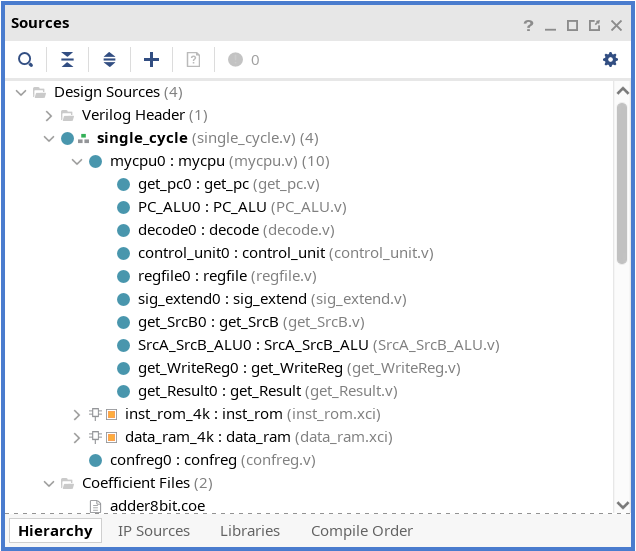
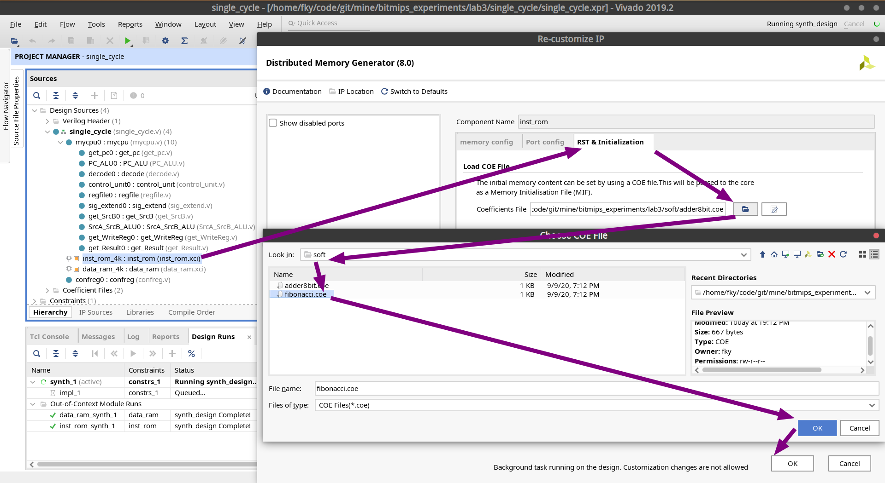

# 单周期 CPU 设计

本实验将设计并实现一个 MIPS 单周期 CPU。

## 实验要求

- 能够对 MIPS 指令编码有一定了解
- 能够对 SOC 有一定认识
- 能够掌握单周期 CPU 的设计模式，并使用 Verilog 编写一个单周期 CPU
- 能够完成本实验并通过仿真测试
- 能够将本实验代码生成 bit 流并下板至精工开发板达到预计效果

## 这个 lab 包含什么内容？

本 lab 提供了一个适用于精工开发板的 SOC，并提供了两个可下板程序。


## 这个 lab 如何帮助你？

在看到这里的时候，你应该正在计划或者已经实现了一个 MIPS 单周期 CPU。

但是以北理工的小学期个人实验为例，此时你的 CPU 只能读取运行测试代码，而暂且无法访问外部设备。

**本 lab 中提供的 SOC 能够帮助你在不需要了解硬件标准的情况下，完成精工开发板的设备访问。**

用白话来说就是：写好 CPU 软件部分后，只需要修改一下接口，就能下板跑一些花里胡哨（指二极管）的程序。


## 实验内容

本实验需要实现一个 MIPS 指令集架构的单周期 CPU，能够完成 7 条简单指令的实现，之后能够自行再添加指令。(本实验中不考虑异常处理，仅实现指令的基本功能。)

本实验的实验代码在对应的代码仓库中的 lab3，实验代码中，已经搭建好了一个基本的 SOC 环境，同时也编写了一套对应的测试代码。做实验时，只需关注基本的单周期 CPU 的设计，而不用去关注除 CPU 的外部环境和测试代码的编写。最终，在通过仿真测试之后也能进行下板操作，下板之后可以看到相应的效果。

在进行实验之前请先阅读相关文档，对本实验的实验代码结构有一定的了解，对一些基本概念有一个认识，之后再根据实验步骤完成相应模块的代码编写。

需要实现的指令如下：

- LUI
- ORI
- ADD
- SW
- LW
- BEQ
- J

具体指令定义请参看 MIPS 指令集手册。

## SOC 使用步骤

### 下载项目

```bash
git clone https://github.com/bit-mips/bitmips_experiments.git
```

### 使用 Vivado 打开项目

点击 `Open Project`，选中 `bitmips_experiments/lab3/single_cycle/single_cycle.xpr` 进入项目。

### 添加你的 CPU 项目

**注意，首先你需要按照[单周期实验指导](./singlecycle.md)修改自己 CPU 的接口，适配 SOC。**

在主面板 `Project Manager > Source` 中点击 `＋` ，并将满足接口要求的 CPU 文件夹添加到项目中。


作为验证，确保 `Source` 面板中 `single_cycle` 下有你的 CPU 实现文件。



### 生成比特流、下板并验证实验效果

其余步骤同正常下板流程。


实验效果见[单周期实验指导-测试用例说明](./singlecycle.md#%E6%B5%8B%E8%AF%95%E7%94%A8%E4%BE%8B%E8%AF%B4%E6%98%8E)。

### 选择另一个 COE 文件

默认情况下， 我们加载的是 8 bit 加法器的程序指令。如果我们想要选择其他的 COE 文件，可以在 `Source` 面板中双击 `inst_rom` ip 核，然后在 `RST & Initialization` 中选择相应的 COE 文件。



