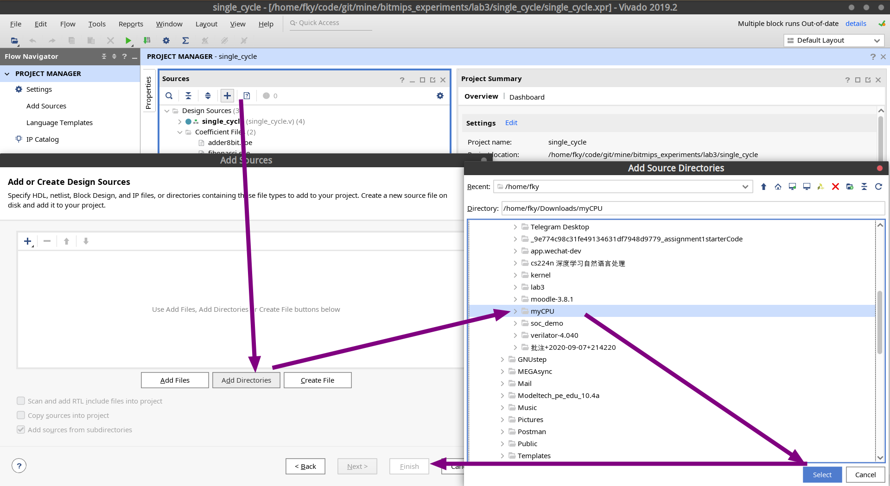
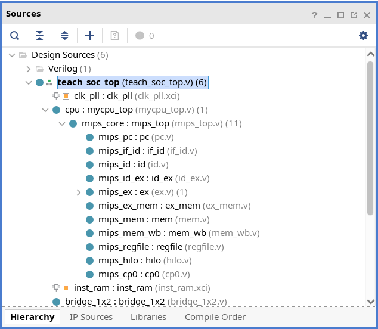
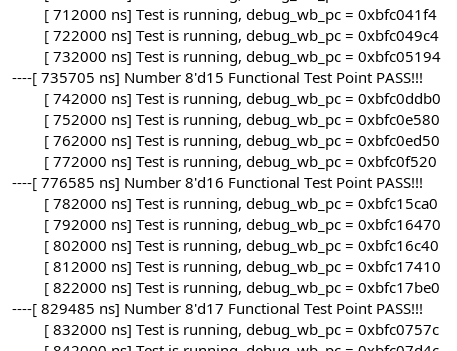
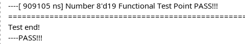
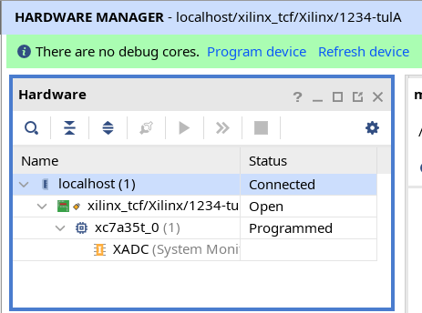
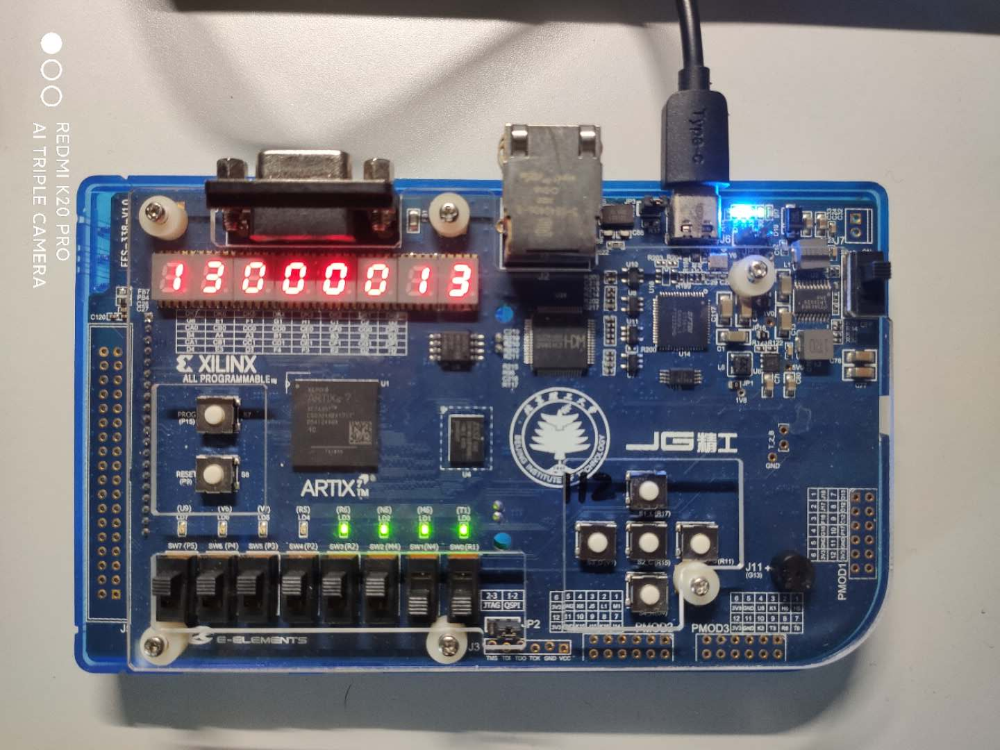

# MIPS CPU 简单流水线设计

## 实验要求

### 你需要自己完成的部分

设计并实现一个 MIPS 指令集流水线 CPU，例如经典的五级流水线。

### 本 lab 能提供给你的部分

本 lab 提供了一个适用于精工开发板的 SOC，并提供了可仿真、可下板的环境。

## 这个 lab 如何帮助你？

在看到这里的时候，你应该正在计划或者已经实现了一个 MIPS 流水线 CPU。

但是如果没有针对外设写相应的代码，此时你的 CPU 只能读取运行测试代码，而暂且无法访问外部设备。同时，也只能通过查看仿真波形来调试。

**本 lab 中提供的 SOC 能够帮助你在不需要了解硬件标准的情况下，完成精工开发板的设备访问。同时程序提供了一个自动对比的一系列测试用例（可仿真或下板）。**

用白话来说就是：写好 CPU 软件部分后，只需要修改一下接口，就可以在仿真环境自动对每个指令运行结果进行对比；并在下板环境跑相关指令的测试用例，并从数码管打印出结果。


## 实验内容

本实验需要实现一个 MIPS 指令集架构的流水线 CPU，能够完成 23 条简单指令的实现，之后能够自行再添加指令。（本实验中不考虑异常处理，仅实现指令的基本功能）

本实验的实验代码在对应的代码仓库 lab5，实验代码中，已经搭建好了一个基本的 SOC 环境，同时也编写了一套对应的测试代码。做实验时，只需关注基本的流水线 CPU 的设计，而不用去关注除 CPU 的外部环境和测试代码的编写。最终，在通过仿真测试之后也能进行下板操作，下板之后可以看到相应的效果。

在进行实验之前请先阅读相关文档，对本实验的实验代码结构有一定的了解，对一些基本概念有一个认识，之后再根据实验步骤完成相应模块的代码编写。

运行下板测试程序需要实现的指令如下：

- `add`
- `addu`
- `addi`
- `addiu`
- `sub`
- `subu`
- `slt`
- `sltu`
- `or`
- `ori`
- `xor`
- `xori`
- `lui`
- `sll`
- `srl`
- `sw`
- `lw`
- `beq`
- `bne`
- `j`
- `jal`
- `jr`

## SOC 使用步骤

### 下载项目

```bash
git clone https://github.com/bit-mips/bitmips_experiments.git
```

### 使用 Vivado 打开项目

点击 `Open Project`，选中 `bitmips_experiments/lab5/teach_soc/teach_soc.xpr` 进入项目。

### 添加你的 CPU 项目

**注意，首先你需要按照[流水线 CPU 顶层接口规范](./soc-interface.md)修改自己的 CPU 的接口，适配 SOC。**

在主面板 `Project Manager > Source` 中点击 `＋`，并将满足接口要求的 CPU 文件夹添加到项目中。

*截图沿用 lab3 实验截图*


作为验证，确保 `Source` 面板中 `teach_soc_top` 下有你的 CPU 实现文件。



### 仿真环境运行自动对比

直接点击 `Run Simulation`

然后运行并观察下方 `Tcl Console` 打印内容。



#### 🎉 仿真环境通过全部测试



#### 🙃 未通过测试


当运行信号和测试用例有不一致的情况时，仿真会自动停止在错误处，并打印对比信息。

在上图中我们能看到测试文件对比了 PC 、回写的寄存器编号与地址，通过这些信息，你可以进行问题排查。
同时，也可以通过停止时已经生成的波形信号进行问题查找。

### 下板跑测试用例

直接点击 `Generate Bitstream` 生成比特流。

完成后，连接精工开发到电脑，并且选择 `Open Hardware Manager`。在打开的界面上方点击 `Auto Connect`，连接硬件设备：



然后选择 `Program device`, `Program`。

此时，程序已经写入开发板。

此时将所有拨码开关上拨 + 最右侧两个拨码开关下拨可以更好的看到数码管变化。
**（下方八个拨码开关其实对应着一个二进制数，代表测试用例之间运行的间隔。都拨上时，这个间隔最小；都拨下时，这个间隔最大）**

正常情况下，当程序写入完成瞬间，数码管左右两侧会出现十六进制数字，从 0 一直加到 13（代表 0x13 个测试点，每个测试点针对一个指令进行多条测试）。

左侧数字表示已经执行完的测试。右侧数字表示通过的测试。

因此如果左右两侧数字不一致，则代表有测试点没有通过。

**如果左右两侧数字一致，则代表测试点全部通过。**



