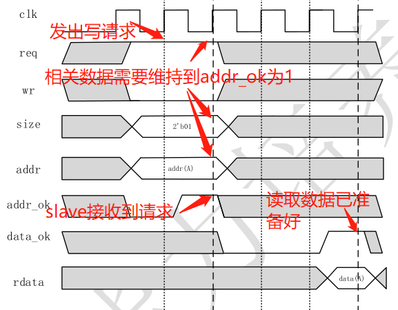
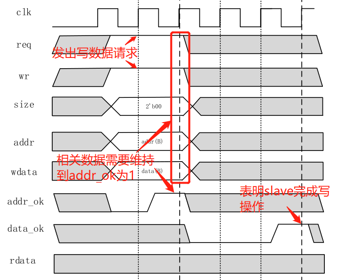
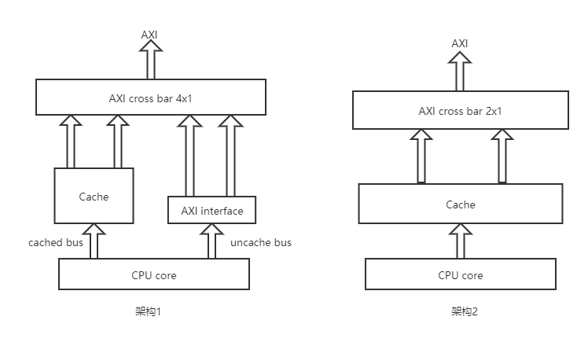
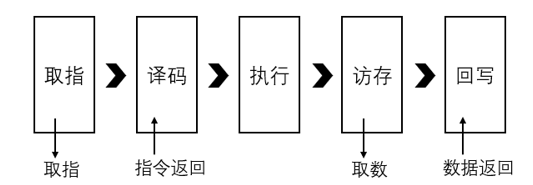
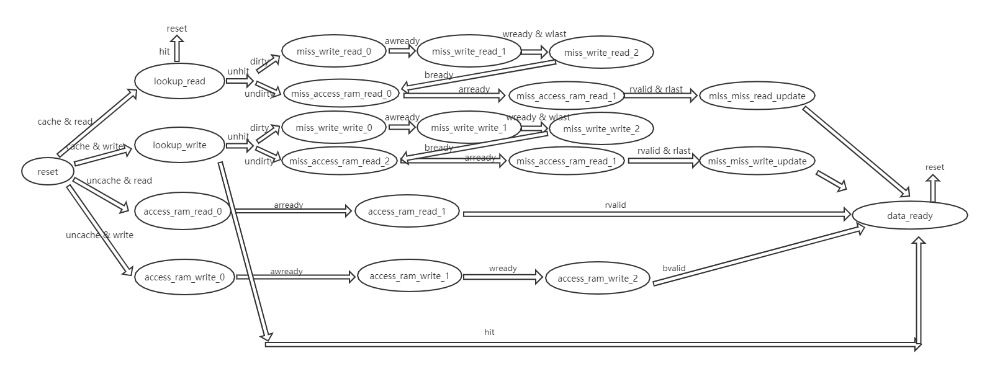

# Cache 设计实验指导

**注：1. 本实验目前只针对参加龙芯杯的同学设定，未来可能会设计一个课堂版本。2. 同时本实验只包含一个说明文档，不包括代码，参加龙芯杯的同学可以根据自己当前设计的 CPU 架构合理的加入一个 Cache 能提高性能即可。3. 做本实验之前请完成龙芯杯初赛的内容。4. 结合龙芯杯文档 A14 来看。5. 以下内容只是往届的一个经验总结，可能有地方表述的并不准确，请多包涵。如有错误也希望能够提 issue 告知我们。**

## 类 SRAM 协议与 AXI 协议简介

龙芯杯初赛内容要求是完成一个 57 条指令的 CPU（包含部分异常处理功能） 并且能通过官方给的测试用例，在这个阶段，参赛队伍实现的 CPU 需要使用 SRAM 接口或者 AXI 接口进行封装。关于 SRAM 接口此处不再赘述。

如果要对实现的 CPU 进行性能测试，那么必需实现 AXI 接口。

一般，如果实现的是 SRAM 接口，那么将改接口转为 AXI 接口也是比较简单的，需要以类 SRAM 协议作为桥梁来转换（或将原 CPU 接口直接设计为类 SRAM 接口），下面简要介绍类 SRAM 接口和 AXI 接口。

> 其实在官方文档（A12）里是有对 SRAM 介绍的，AXI 的介绍可以去看 AMBA 总线文档。下面内容只是对重点进行的一个重复说明。

### 类 SRAM 协议
可以知道，SRAM 接口是没有握手协议的，所以当 CPU 向外发出访存信号时，读取的数据的频率需要与 CPU 的频率同步，进而会限制 CPU 频率（访存操作是一个相对耗时的过程）。而类 SRAM 增加了握手信号，这样就可以根据握手信号来进行同步，读取的数据可以在任意周期内返回。由于在 `SoC_SRAM_Lite` 中使用的存储器是 BRAM 构建的，而 BRAM 读取是由一个固定周期的延时，因此相对比较好处理。

此处着重说明 `addr_ok` 和 `data_ok` 两个信号：

|信号|位宽|方向|说明|
-|-|-|-
addr_ok|1|slave—>master|当该信号为 1 时，表明 slave 已接受到 master 发出的请求，即读数据时指读地址已被接收，写数据时指写地址和写数据已被接收。
data_ok|1|slave—>master|当该信号为 1 时，表明本次数据传输完成，即读数据时指当前的 rdata 通道就是读取的数据，写数据是表明写数据操作已完成。

一次读数据时序解析：

一次写数据时序解析：

**关于 SRAM 转类 SRAM 接口**：一般，如果原来 CPU 接口是 SRAM 接口，需要写额外的程序将 SRAM 接口转为类 SRAM 接口。这一部分可以使用状态机来完成。那么同时需要在 SRAM 接口中增加暂停控制信号，因为数据读写时间延迟是不固定的，虽然类 SRAM 可以通过握手信号来同步，但是内部 CPU 是 SRAM 接口没有握手信号，需要添加暂停信号来控制流水，已达到同步的目的。（其实可以直接将 CPU 的出口设计为类 SRAM 接口也是可以的）

### AXI 协议
在 AMBA 总线协议中有对 AXI 协议的详细介绍，在龙芯官方的 SOC 上使用的是 AXI4 Lite 是一个 AXI 的简化版本，省去了一些不必要的接口信号。

AXI 协议分为读通道和写通道，读通道有两组信号（读地址通道信号，读数据通道信号），写通道有三组信号（写地址通道信号，写数据通道信号，写响应通道信号）。

读通道：
- 读地址通道信号：主要是由 master 发出读请求，包含读取的地址、握手相关的信号。
- 读数据通道信号：主要是由 slave 发出读响应，即向 master 发送读取到的数据，包含读取的数据、握手相关信号。

写通道：
- 写地址通道信号：主要是由 master 发出写请求，包含写的地址、握手相关的信号。
- 写数据通道信号：主要是由 master 发出的写数据，包含要写的数据、握手相关信号。
- 写响应通道信号：主要是由 slave 发出的写恢复信号，指明写操作完成，包含相关握手信号。

当 CPU 完成类 SRAM 接口之后，可以使用龙芯官方提提供的 `cpu_axi_interface.v` 转换接口来将类 SRAM 转换为 AXI 接口，但是这个转换接口效率较低，并且不支持 burst 传输，如果要使用 Cache 那么必须需要支持 burst 传输。

AXI 不细说，涉及的信号比较多，看一下 AMBA 协议手册是比较容易懂的。

## 实验指导

本章节不对 Cache 原理进行介绍，关于 Cache 原理可以参考计算机体系结构等书籍了解。在实现 Cache 之前，请对 AXI 协议进行充分的了解。

### Cache 属性

查看官方文档 A12 或 MIPS 手册。

### 可参考的两个 Cache 架构

如果不实现 Cache，将CPU 封装为 AXI 接口，使用龙芯性能测试用例来进行性能测试时，所得到的性能分数是比较低的，如果实现了 Cache，那么 CPU 性能分数可以显著的得到提升。因此，如果希望进入决赛，那么必须要实现 Cache，并且 Cache 的性能还必须达到一定的高度。

CPU 与 Cache 的联通方式可以有不同的架构，下面介绍两种基本架构仅供参考。如图：

**架构1**：
在架构一中，从 CPU 中出来的数据请求包括两类，一类是 Uncached 的，一类是 Cached 的。对于 Uncached 类数据请求，数据不能通过 Cache 缓存，也就是说需要直接对存储器或外设进行访问，这是可以理解的，比如访问外设数据，一般读写外设是需要实时的操作，如果将要写入的数据放到缓存，那么外设就不能及时得到数据。架构 1 的想法就是将 Uncached 和 Cached 两类数据请求分开，如果不需要 Cache 缓存，那么就直接访问外设和数据存储器。需要 Cache 缓存的就再通过缓存。这样最终会有 4 个 slaver（cached inst bus，cache data bus，uncached inst bus，uncached data bus），通过一个 AXI cross bar IP 的作用可转换成一个 AXI 接口，最终给接到龙芯 AXI SOC。

**架构2**：
相比于架构 1，架构 2 是将所有的请求都通过 Cache，即 Cache 内部状态机根据数据请求是 Uncached 还是 Cache 的来自动的进行缓存。数据请求是 Uncached 时，Cache 仅充当一个“桥梁”作用，不起到缓存的作用，只有数据请求是 Cached 时才起到缓存的作用。在这种架构下，CPU core 的接口需要提供一个信号指明本次数据请求是 Cached 还是 Uncached。

### 实现细节

具体实现要能把握一下几个要点：

#### 1. Cache 性能

对于 Cache 的实现，不同的实现具有不同的性能，这个性能具体体现在当 Cache 命中时数据返回所需要花费的周期的多少。也就是说，在最理想的情况下，当 Cache 命中时是不可以阻塞流水线的流动的，数据仿佛是在发出读写信号时就立即返回了。而 Cache 内部的命中时间花费需要由 Cache 内部自动消化，对于单发射的 CPU 此时的 CPI = 1。

一般，要想使 Cache 命中时 CPI = 1，这需要 CPU core 和 Cache 能够良好的交互，需要有一个比较高效的总线，有时可能会导致 CPU 与 Cache 耦合较为紧密。

#### 2. 使用 BRAM 搭建 Cache

一些队伍在实现 Cache 时可能会使用 Reg 变量直接搭建（或使用 DRAM，最终也是转换为 Reg），这时如果设计的 Cache 比较大那么会耗费较多的 LUT 资源，并且综合实现过程会极度缓慢。官方建议是使用 Block Memory Generator IP 来搭建。

使用 BRAM 进行搭建时会有一个问题，就是 BRAM 读写数据时会有一个时钟周期的延时。这将使得 Cache 即使命中读写也会至少有一个周期的的延时。这时可能需要使用流水线来消耗这个周期。一种解决方式如下：

对于指令来说，在取值阶段发出取值请求，此时不等待数据返回，流水线继续流动一个周期，而此时如果 Cache 命中，那么下个周期就可以得到数据（前提是 Cache 设计合理）。到译码阶段时，Cache 将命中数据返回，然后数据即指令参与到译码。如果 Cache 未命中，此时可以再让流水线暂停。这样就可以让流水线消耗掉 BRAM 由于读写延时产生的一个周期延时。对于数据存取可以采用同样的方式，在访存阶段发出读写请求，然后流水线继续流动，在回写阶段根据 Cache 是否命中选择是否暂停流水线。

#### 3. Cache 内部的状态机设计

Cache 内部需要有一个状态机来协调工作，一方面需要顾及 Cache，一方面也需要顾及接口。我们已上文的架构 2 来讨论一个状态机的设计。下图，是一个数据 Cache 的内部状态机的示意图：

首先，这个状态机看起来比较复杂是因为为了能够详细表述每个阶段，我把所有状态全部拆分出来了，实际上在实现的过程中可以考虑一些状态的合并。我们来举两个例子分享。

- 以一次数据写请求为例（过 Cache）：
  - 首先 CPU 发出一个数据写请求，同时表示这是需要经过 Cache 的，状态机查表，看是否 hit，如果 hit，下个周期即可写入 Cache，进入 `data_ready` 状态（该状态为一次读写请求做最后处理，如修改 `dirty` 值等）；如果没有 hit，下个周期进入 miss 处理阶段。
  - 根据替换算法，如果被替换空间的 `dirty` 标记为 1，那么就需要先将该区域的值写回到内存，即需要经过 `miss_write` 等若干阶段；否则，那么就可以直接将要写的数据读取到内存，然后将相应位置的数据进行更新，之后进入最后的 `data_ready` 阶段。
- 以一次数据读请求为例（不过 Cache）:
  - 不经过 Cache 时处理相对简单，直接根据 AXI 协议来进行处理，通过握手信号确定状态的改变，最终读取到信号后进入 `data_ready` 阶段。

#### 4. 关于 Cache 的大小设计

龙芯官方给出的建议如下表：

|属性|Inst Cache|Data Cache|
|-|-|-|
|大小|8 KB|8 KB|
|way 数|2 way|2 way|
|bank 数|8|8|
|Byte/bank|4 Byte| 4 Byte|
|深度|128 set|128 set|

由上可知，指令 Cache 和数据 Cache 的大小是相同的都是 \\(8KB = 2 way \times 128 \ set/way \times 8 \ bank/set \times 4 \ Byte/bank\\)，在实际实现的时候可以考虑设计为 4 路组相联，尤其数指令 Cache 设计为 4 路组相联性能会提升相对较多。bank 数也可由 8，改为16，这样每次 burst 可以传输更多的数据。

以上的这些是只考虑了单独的数据存储所花费的空间，在实际实现中还会有 `tag`，`dirty` 这些属性以及实现替换算法会花费一部分存储资源。

#### 5. 关于替换算法

目前来说替换算法肯定是要实现 LRU 算法的，如果是 2 路组相联，每一行只需要 1 位数据即可，即上述的 Cache 需要 \\(128 \times 1\ bit\\) 的存储资源用于实现替换算法。如果是 4 路组相联，那么需要的存储资源也会更多，同时实现起来也会更复杂。毕竟，对于 2 路组相联，当访问其中一路时，那么这一路就是最近访问的，另外一路就会被替换，这样就可以使用 1 bit 数据就可以表示哪一路数据要被替换掉。

替换算法其实也是可以进行改进的，除了 LRU 算法以外还有一些其他的替换算法，也可以看一些文献，将一些最新的科研成果加入到设计之中。

**参考：**
1. 龙芯杯官方文档
2. AMBA 协议手册