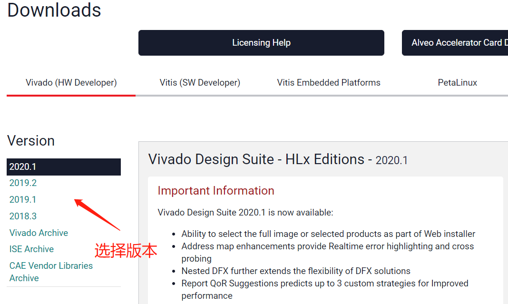
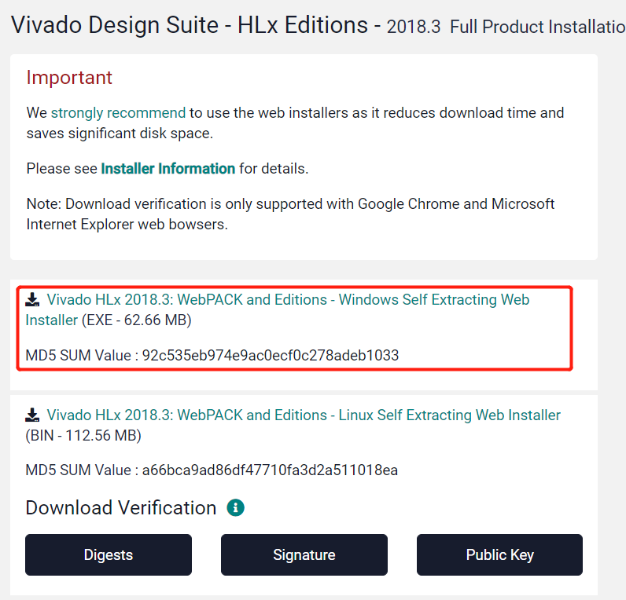
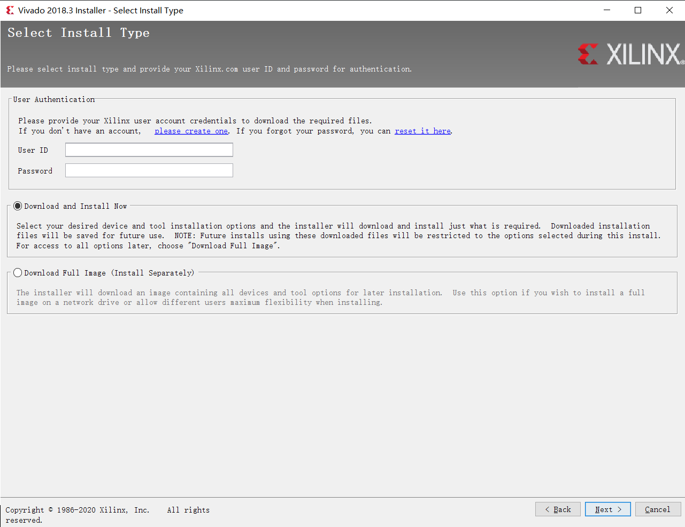
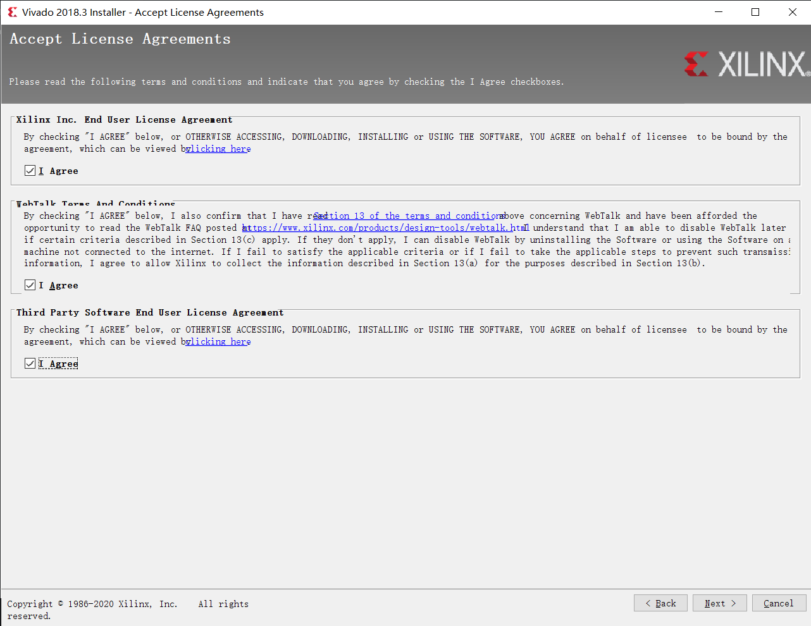
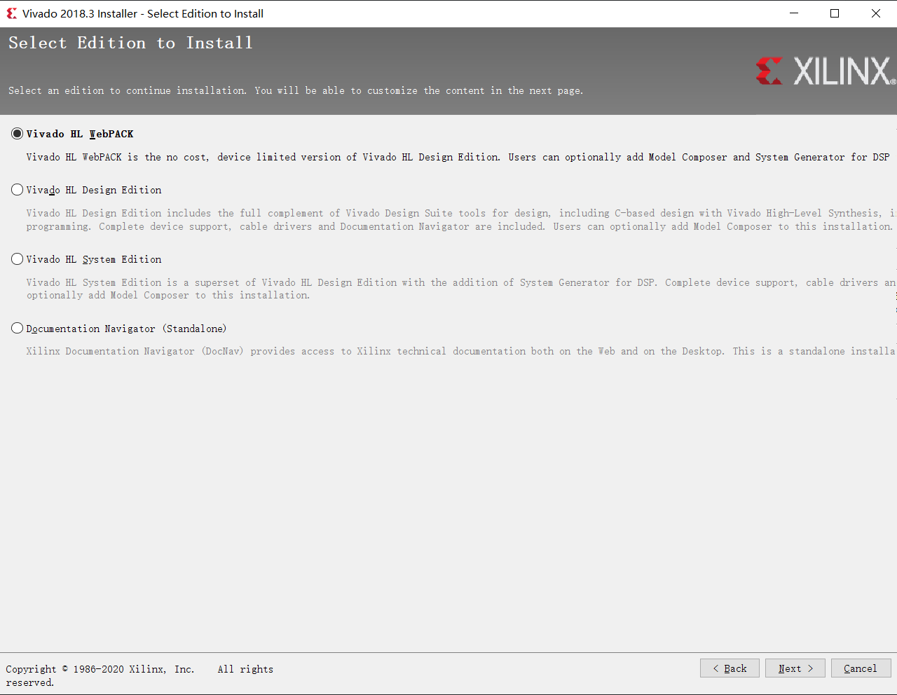
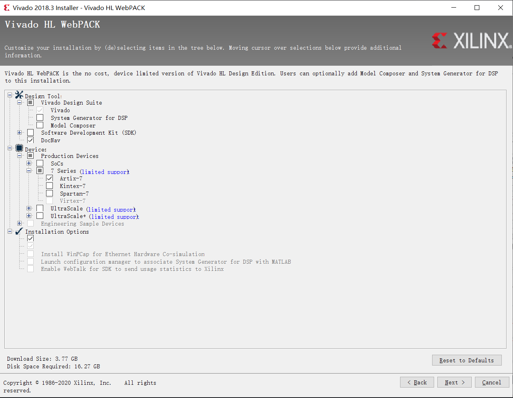
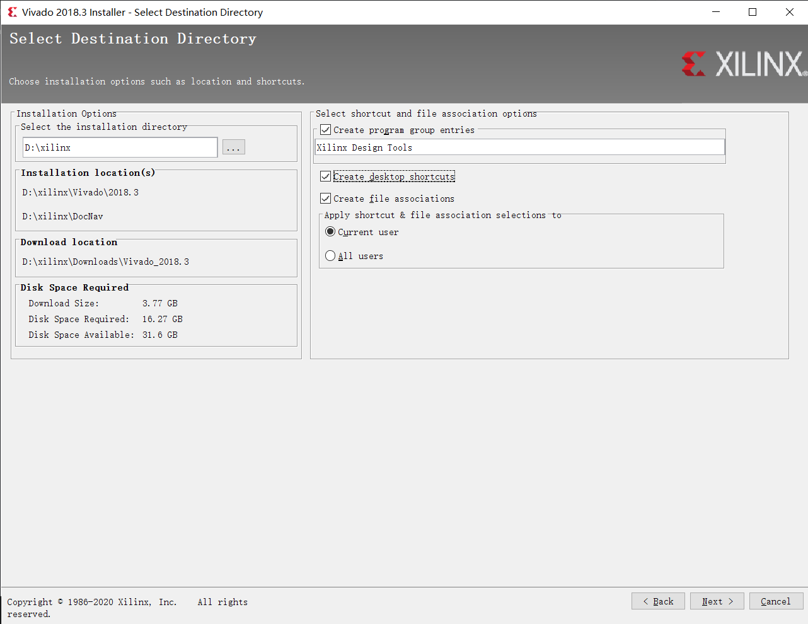
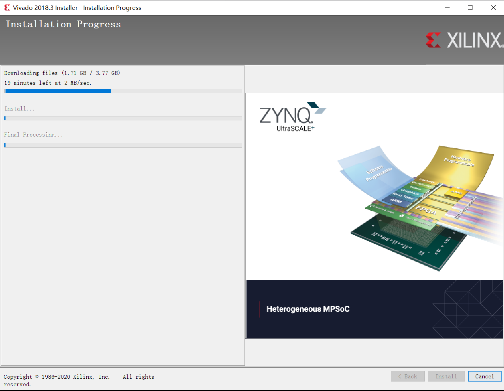

# Vivado 下载及安装

## 下载

这里以 Vivado 2018.3 为例，介绍在 Windows 10 上的下载及安装过程。

- 在 [Xilinx](https://www.xilinx.com/) 官网注册一个账号，相关信息尽量填全。
- 进入[下载页面](https://www.xilinx.com/support/download.html)，选择一个需要的版本

  

- Vivado 可以下载离线安装版本和在线安装版本，**强烈建议下载在线安装版本，然后在线下载安装**。即选择如下的 `WebPack` 版本。

  

- 下载至本地，双击开始在线安装。

## 安装

- 首先需要用户验证，输入自己的 Xilinx 账号和密码，然后选择 `Download and Install Now`

  

- Accept License，全部 Agree

  

- 选择 `Vivado HL WebPACK` 版本安装

  

- 默认的安装选项比较多，可以只选择几个必须的，其中 `Device`要选择 `7 Series` 的 `Artix-7`

  

- 然后选择一个安装路径就可以开始下载安装了，可以看到，Vivado 的下载安装需要大量的磁盘空间（约20G），下载安装之前请确保磁盘空间足够。

  

- 下载安装过程如下

  