# IP 介绍

## 简介

IP 核就是知识产权核或知识产权模块的意思，在 EDA 技术开发中具有十分重要的地位。美国著名的 Dataquest 咨询公司将半导体产业的 IP 定义为“用于 ASIC 或 FPGA 中的预先设计好的电路功能模块”。（转自百度百科）

简单理解 IP 核就是一个别人写好的模块，与 C 语言中的库函数一样，可以供使用者调用。

## 使用

以下以调用 `Block Memory Generator` 为例。

- 首先使用 Vivado 创建一个工程，在主界面的左侧边栏中点击 `IP Catalog`，会弹出 `IP Catalog` 界面，在 `Search` 处可以搜索需要的 IP，或者在 `Vivado Repository` 手动查找。

    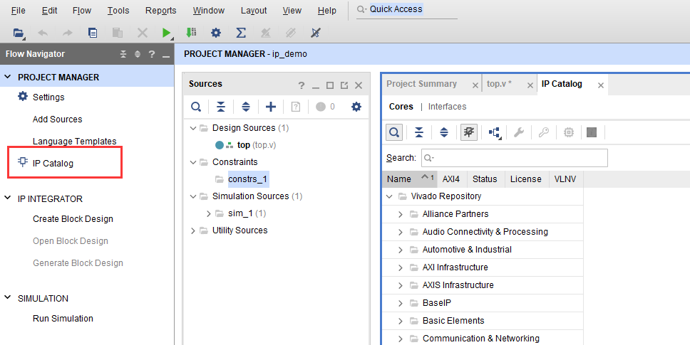

- 调用一个 `Block Memory` IP 核，双击选中的 IP 核，`Block Memory` 就是我们常说的 bram，可以用来作为指令和数据存储器。

    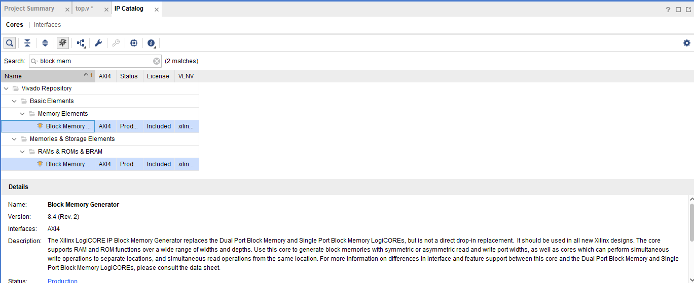

- 双击之后会进入一个配置该模块的界面，在左上角的 `Documentation` 可以查看该 IP 手册，`Component Name` 可以为这个模块定义一个名字，方便调用，模块名下方的窗口就是对该模块进行具体配置界面。

    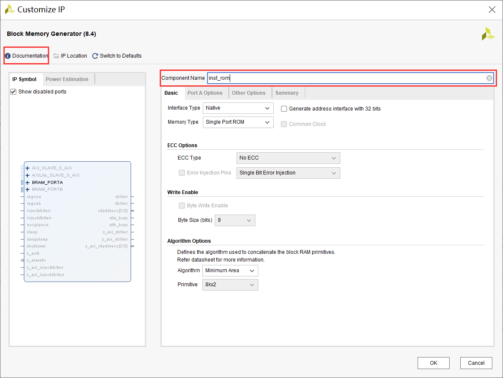

- 配置 `Block Memory` 为一个指令存储器，如上图，选择 `Memory Type` 为 `Single Port ROM` 即单口只读存储器（数据存储器可以配置为 RAM）。在 `Port A Options` 选项卡中，可以配置端口数据宽度，以及数据深度，因为 MIPS 指令是定长 32 位，数据宽带定为 32，深度可以自定义，定为 1024 时该存储器大小就是 1024 Words，即 4KB。BRAM 读取访问是有延时的，当勾选上 `Primitives Output Register` 时延时是 2 Clock Cycle，不勾选是 1 Clock Cycle，一般不勾选。在 `Other Options` 选项卡中可以给该存储器配置 [coe](./cross_compiler.md#coe-文件说明) 文件，这样可以为该存储器初始化数据。

    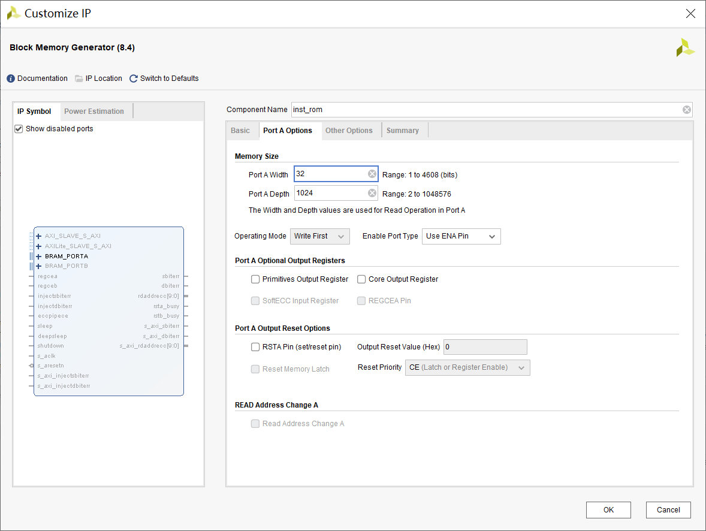

    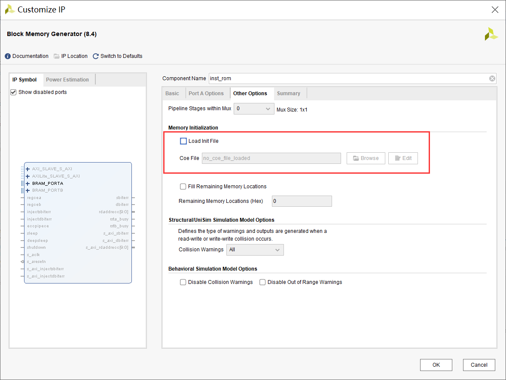

- 在 `Summary` 选项卡可查看最终配置情况总结。配置完备，点击 `OK` 即可。最终在 `Source` 目录可以看到该模块。此时这个模块跟你写的模块没有任何区别，只需按照他的接口要求来添加代码即可。

    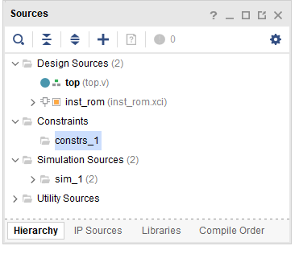

- 如何获取该模块接口信息？可以查看文档说明。另外一种方式是点击在 `Source` 目录点击 `IP Source` 找到该模块，展开 `Instantiation Template` 可以看到一个 `inst_rom.veo` 文件，双击该文件，在代码编辑区查看内容，其中的代码即是该模块调用示例。按照示例来调用该模块即可。

    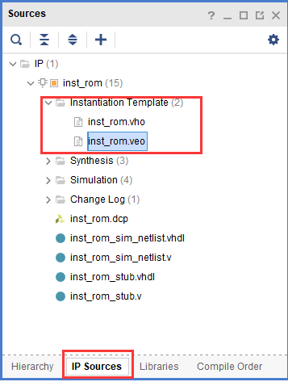

    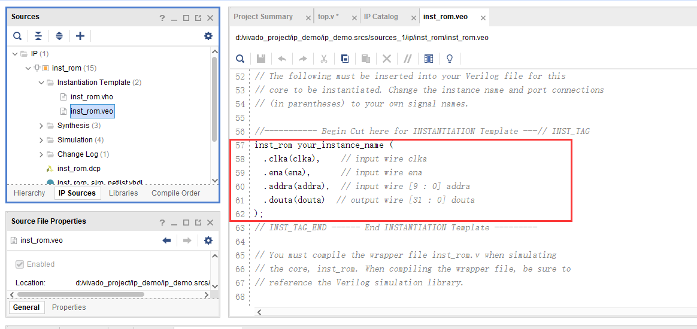

## 将模块封装为 IP

现在，假设写好了一个模块，那么是可以将该模块封装为 IP，封装为 IP 之后就可以供他人或自己再调用。

以下介绍如何将代码封装为 IP。以封装当前工程为例。

- 点击工具栏 `Tools -> Create and Package New IP`，在弹出框点击 `Next`。

    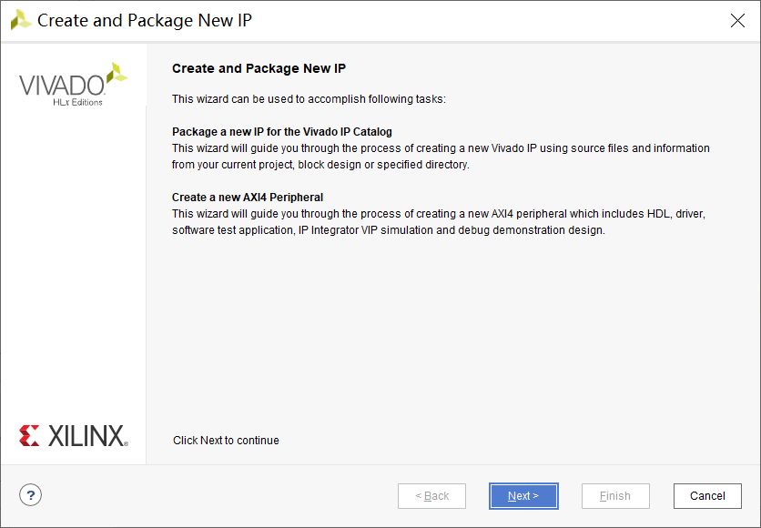

- 之后，选择 `Package Options` 为 `Package your current project` 即封装当前工程。点击 `Next`。

    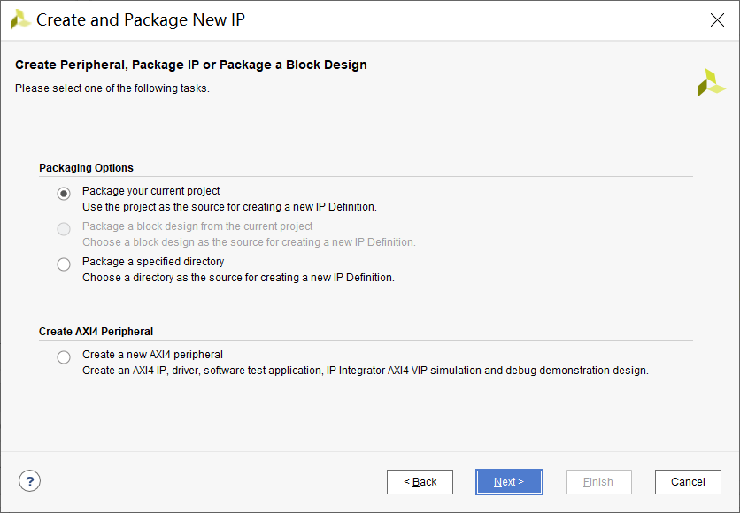

- 之后是确定封装文件放置的目录。`Package IP in the project` 选择 `Include .xci files`。点击 `Next`，弹出界面点击 `Finish`。

    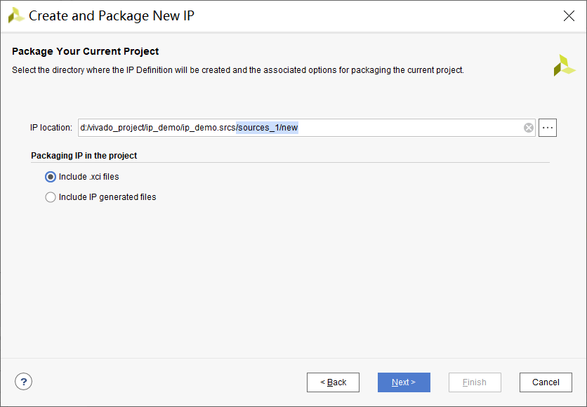

- 之后会弹出 `Package IP` 标签页。
    - `Identification` 可查看并修改 IP 的相关信息。
    - `Compatibility` 标签下给出了这个 IP 可以支持的 FPGA 系列，默认是支持全部系列。
    - `File Groups` 中可以看到这个 IP 包含的文件。
    - `Customization Parameters` 是将 IP 设置为可配置，需要代码模块有可配置参数。
    - `Ports and Interfaces` 查看接口管脚信息。
    - `Customization GUI` 设计 IP 调用时的配置界面。
    - `Review and Package` 最终查看，点击 `Package IP` 来完成封装。

    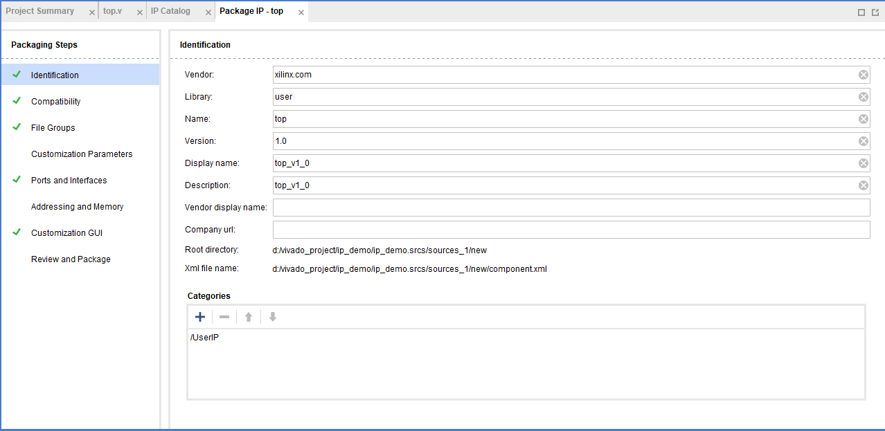

## 调用封装 IP

现在来调用上文封装的 IP。

- 新建一个工程，点击界面左侧的 `Setting` 弹出如下界面，选择 `Project Setting -> IP -> Repository`，点击 `+` 号，将上文封装 IP 时指定的封装文件放置目录添加进去，点击 `OK`。

    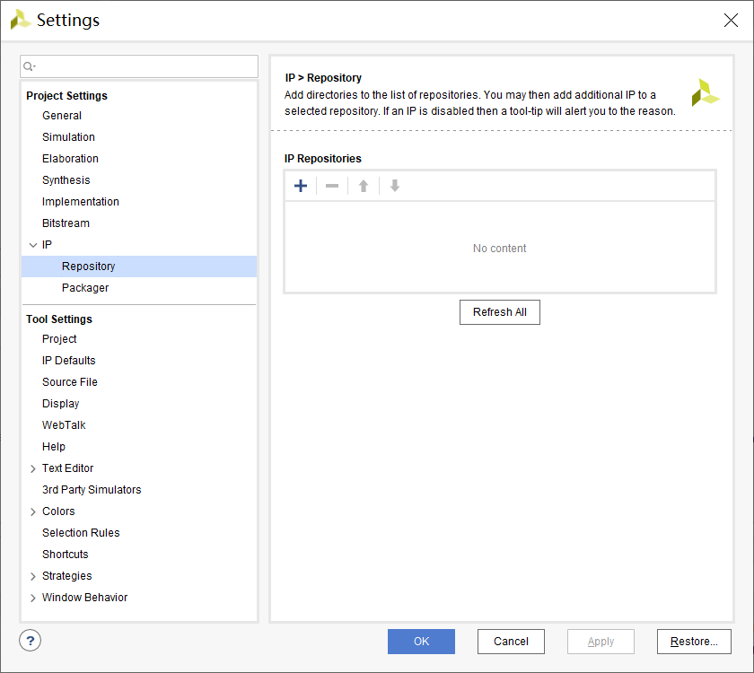

- 完成上述操作之后，打开 `IP Catalog`，在 IP 目录会多出一个 `User Repository`，在其中可以找到刚才封装的模块。之后双击该模块就可以愉快的调用了。

    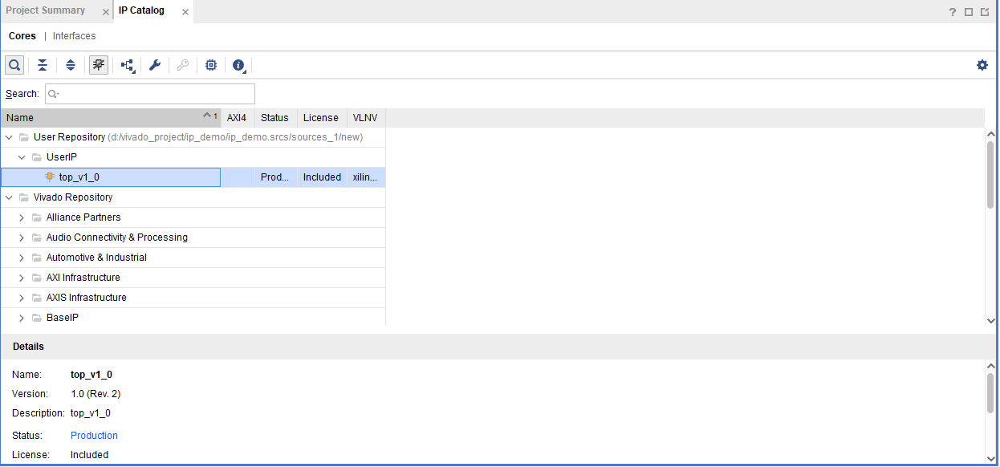
