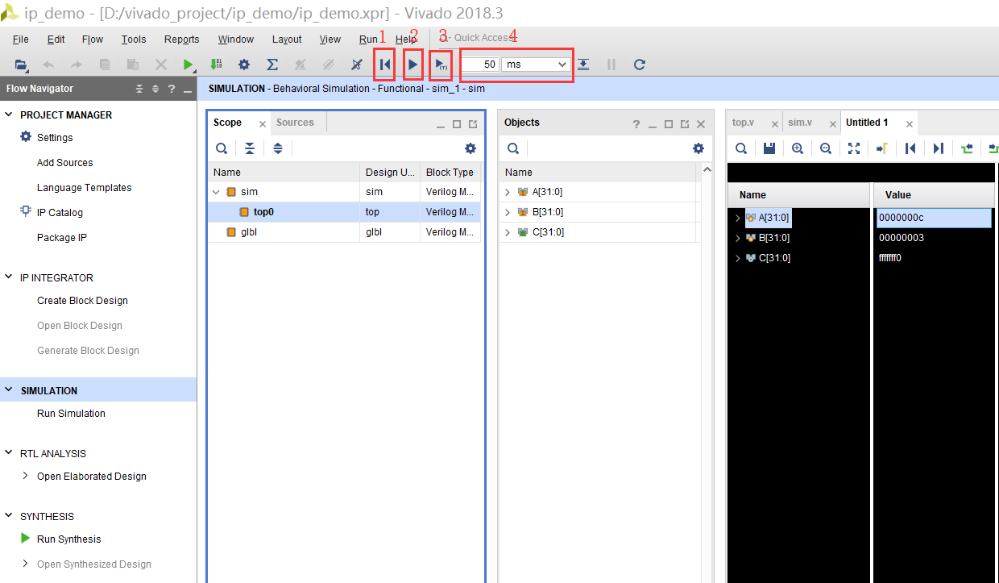
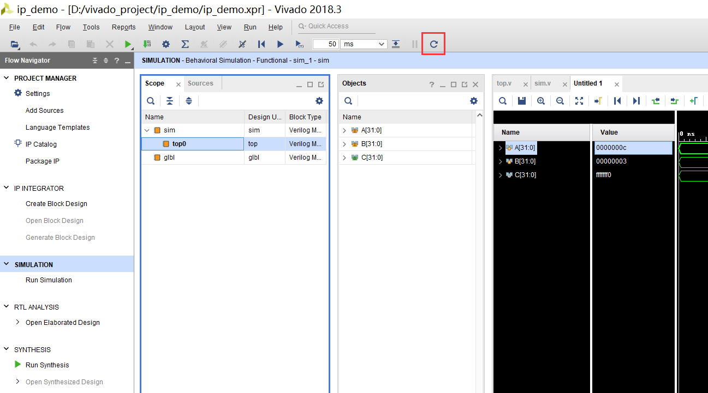
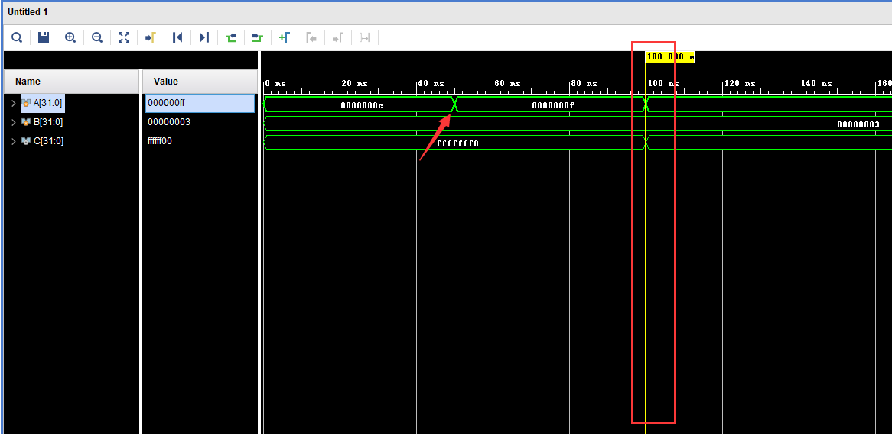
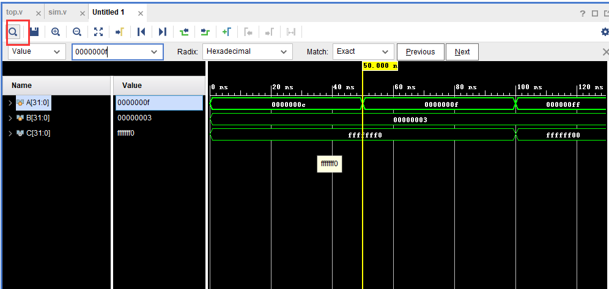

# Vivado 使用小技巧汇总

## UI 功能

### 仿真
- 仿真时可以关注以下方框中几个按钮
    - 1. 重新仿真，仅将仿真时间拉回到 0 ns，不重新编译源文件。
    - 2. 暂停或开始仿真
    - 3. 仿真时间线前进，具体前进时间为方框 4 中指定的时间。
    - 4. 设置每次时间线前进时间，左边是数字，右边是尺度。

    

- 在仿真的过程中，如果修改了某个源文件，无需再重新点击 `Run Simlation`，可以点击下图中红色方框按钮，刷新仿真结果。

    

- 查看仿真波形时，波形中的一根黄色的辅助线是十分有用的。在下图中，当前选中了信号 A（可以看到信号 A 的波形被加粗了），此时按键盘上的 `左右方向键`，黄色辅助线就会移动到信号 A 在左边或右边改变的那个时间点。这种方式可以用来查找信号改变时间点。

    

- 下图中红色方框内的按钮（快捷键 `ctrl + F`）可以用来查找信号值。黄色辅助线会自动移动到那个值的位置。

    

## 快捷键

|按键组合|功能|
|-|-|
|ctrl + F|当前文件查找|
|ctrl + 鼠标滑轮|缩放波形图|
|ctrl + shift + 光标|选中代码某一列|